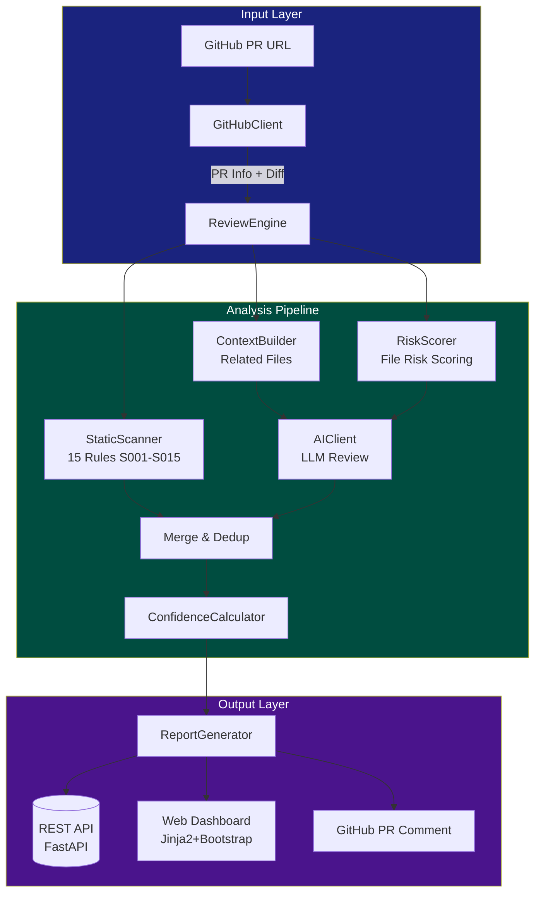

# AI Review Cockpit

Not just another AI code reviewer. We analyze changed lines, score file risk,
combine static rules with AI reasoning, and only surface findings with **evidence and confidence**.

[](https://github.com/HuLi-12/ai-pre-review/actions/workflows/ci.yml)

---

## Demo

> Full walkthrough with screenshots: [`docs/demo/README.md`](docs/demo/README.md)

### 1. Submit a PR

Enter a GitHub PR URL on the home page. The system fetches the diff, file list, and commit metadata — then launches a 7-stage analysis pipeline.

```
Home Page ─→ Progress Page ─→ Cockpit Report ─→ (optional) GitHub Comment
```

### 2. Watch the Pipeline

Real-time progress tracking across all 7 stages:

| # | Stage | What Happens |
|---|-------|-------------|
| 1 | FETCHING_PR | Parse PR URL, fetch metadata + diff via GitHub API |
| 2 | BUILDING_CONTEXT | Identify related files, build multi-layer context |
| 3 | STATIC_SCAN | Run 15 deterministic rules on patch added lines |
| 4 | AI_PR_SUMMARY | LLM generates PR-level summary |
| 5 | AI_FILE_REVIEW | Per-file deep/normal analysis by risk score |
| 6 | AI_CROSS_FILE | Cross-file consistency check (≥2 files) |
| 7 | MERGING_RESULTS | Signature dedup + confidence scoring + threshold filter |

### 3. Review the Cockpit Report

The report page is a **Review Decision Cockpit** with 5 integrated modules:

```
┌──────────────────────────────────────────────────────────────┐
│  Metric Cards: Risk Level | Confidence | Findings | Decision  │
├──────────────┬───────────────────────────────────────────────┤
│ File Risk Map│ Pipeline Bar: Raw→Deduped→Visible→GH Ready    │
│              │ Review Decision Card with reasons             │
│ Click file   │ Findings by severity with Evidence Chain      │
│ to filter    │ Feedback buttons: Valid / FP / Resolved       │
└──────────────┴───────────────────────────────────────────────┘
```

### 4. GitHub Comment

High-confidence findings (≥ 0.80, or ≥ 0.70 for critical/high) can be auto-posted to the PR conversation. Re-running the review updates the existing comment — **no spam, no duplicates**.

---

## Innovation Points

### Changed-Line Review

Traditional AI review scans old code and flags pre-existing issues as if they were new. We **only analyze added and modified lines** in the patch — no legacy noise, no false attribution.

```python
# parse_patch() extracts only added lines from unified diff
added_lines = [line for line in patch if line.startswith('+') and not line.startswith('+++')]
```

### Risk-Aware Routing

Not all files are equal. We score each file by path pattern, change size, and keyword to decide analysis depth:

```
controller.py  → score 85 → deep review (full content + related files)
README.md      → score 10 → skip (no analysis needed)
service.py     → score 55 → normal review (patch only + summary context)
```

### Hybrid Rule + AI Engine

- **15 static rules** catch deterministic issues: hardcoded passwords (S005), unsafe SQL (S014), empty catch blocks (S003), N+1 queries (S011)
- **AI** catches what rules cannot: missing null check (S006), transaction risk (S013), missing pagination (S012)
- Both agree → **confidence bonus** (+0.20)

### Confidence Gate

Every finding has a confidence score. Three thresholds control visibility:

| Threshold | Visibility | Use Case |
|-----------|-----------|----------|
| ≥ 0.80 | GitHub-ready | Auto-comment to PR |
| 0.60–0.79 | Report only | Visible in cockpit, not posted |
| < 0.60 | Hidden | Filtered by default |

Confidence formula: `base + evidence + agreement - uncertainty`

### Signature Dedup

Merges duplicate findings by file + type + line bucket + title similarity. Same issue caught by both static rule and AI? **Automatically merged with an agreement bonus.**

### Evidence Chain

Every finding carries a structured evidence trace showing exactly why it was flagged:

```
Changed File → Line Number → Rule Match / AI Source → Confidence Gate
```

Example:
```
user_service.py → line 42 → S005 hardcoded_password → 85% (GitHub-ready)
```

### Review Decision Cockpit

The report page is designed as a **merge decision aid**, not just a finding list:

- **Pipeline Bar**: See how raw findings are filtered through dedup → confidence gate → GitHub-ready
- **File Risk Map**: Visual risk scores per file with click-to-filter
- **Review Decision Card**: "Block merge" / "Fix before merge" / "Review recommended" / "Ready to merge"
- **Evidence Chain**: Per-finding evidence trace for explainability
- **Feedback System**: Mark findings as Valid / False Positive / Resolved

---

## Architecture



### Pipeline Stages

| Stage | Step | Description |
|-------|------|-------------|
| 1 | FETCHING_PR | Parse PR URL, fetch metadata + diff via GitHub API |
| 2 | BUILDING_CONTEXT | Identify related files, build multi-layer context |
| 3 | STATIC_SCAN | Run 15 deterministic rules on patch added lines |
| 4 | AI_PR_SUMMARY | LLM generates PR-level summary |
| 5 | AI_FILE_REVIEW | Per-file deep/normal analysis by risk score |
| 6 | AI_CROSS_FILE | Cross-file consistency check (≥2 files) |
| 7 | MERGING_RESULTS | Signature dedup + confidence scoring + threshold filter |

---

## Quick Start

```bash
# 1. Configure environment
cp .env.example .env
# Edit .env: set GITHUB_TOKEN, AI_API_KEY, AI_BASE_URL

# 2. Install dependencies
pip install -r requirements.txt

# 3. Start server
python main.py

# 4. Open browser
open http://localhost:8000
```

---

## Testing

```
tests/
├── test_diff_utils.py          # Parse patch edge cases (5 tests)
├── test_static_scanner.py      # S005/S014/S011/S010, safe patterns (8 tests)
├── test_risk_scorer.py         # Scoring by path/keywords/size (6 tests)
├── test_confidence_calculator.py # Thresholds, agreement, overrides (7 tests)
└── test_github_client.py       # URL parsing (3 tests)
```

Run tests:
```bash
python -m pytest tests/ -v
```

---

## Project Structure

```
main.py                          # FastAPI server + page routes
config.py                        # Settings (GitHub/AI/DB)
app/
  github_client.py               # GitHub API: PR info, diff, comments
  static_scanner.py              # 15 static rules, patch-only scanning
  diff_utils.py                  # Unified diff parser (added lines only)
  risk_scorer.py                 # File risk scoring engine
  ai_client.py                   # LLM client with structured prompts
  confidence_calculator.py       # Confidence scoring with rule overrides
  context_builder.py             # Multi-layer code context assembly
  review_engine.py               # 7-stage review orchestration
  report_generator.py            # Report + GitHub comment formatting
  models.py / schemas.py         # DB models + API schemas
  routers/                       # REST API endpoints
templates/                       # Jinja2 web UI
docs/demo/                       # Demo walkthrough
```

---

## API

| Method | Path | Description |
|--------|------|-------------|
| POST | `/api/tasks` | Create PR review task |
| GET | `/api/tasks/{id}` | Get task status |
| GET | `/api/tasks/{id}/report` | Get review report with findings |
| GET | `/api/tasks/{id}/files` | List changed files with risk scores |
| GET | `/api/tasks/{id}/file/{file_id}/findings` | File-level findings |
| POST | `/api/findings/{id}/feedback` | Submit feedback (VALID/FP/RESOLVED) |

---

## Tech Stack

Python 3.10+ · FastAPI · SQLAlchemy · SQLite · Jinja2 · Bootstrap 5
