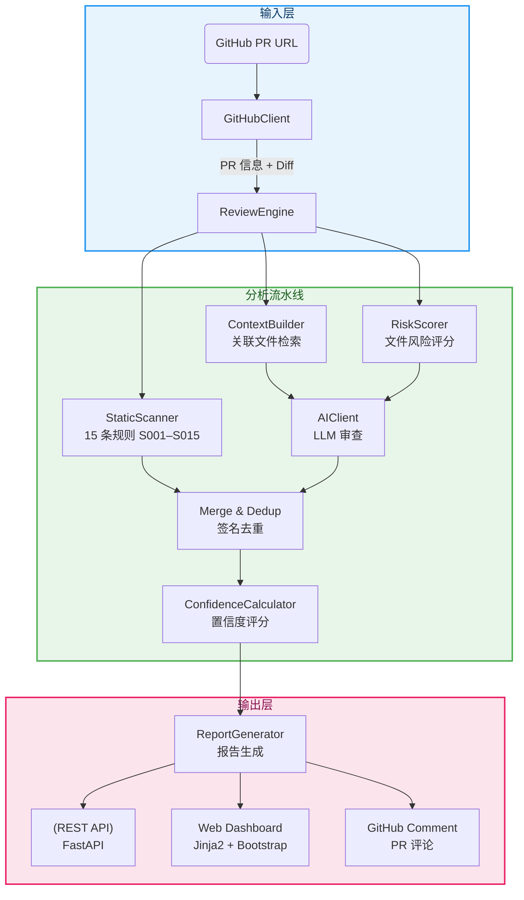

# AI Review Cockpit

不只是又一个 AI 代码审查工具。我们分析变更行、计算文件风险、结合静态规则与 AI 推理，只展示**有证据和置信度**的发现。

[](https://github.com/HuLi-12/ai-pre-review/actions/workflows/ci.yml)

---

## 演示

> 完整操作指南含截图：[`docs/demo/README.md`](docs/demo/README.md)

### 1. 提交 PR

在首页输入 GitHub PR 地址。系统获取 diff、文件列表和提交元数据，然后启动 7 阶段分析流水线。

```
首页 ─→ 进度页 ─→ 驾驶舱报告 ─→ (可选) GitHub 评论
```

### 2. 观察流水线

实时跟踪全部 7 个阶段：

| # | 阶段 | 说明 |
|---|------|------|
| 1 | FETCHING_PR | 解析 PR 地址，通过 GitHub API 获取元数据和 diff |
| 2 | BUILDING_CONTEXT | 识别关联文件，构建多层上下文 |
| 3 | STATIC_SCAN | 对 patch 新增行执行 15 条确定性规则 |
| 4 | AI_PR_SUMMARY | LLM 生成 PR 级摘要 |
| 5 | AI_FILE_REVIEW | 按风险分数对每个文件进行深度/普通分析 |
| 6 | AI_CROSS_FILE | 跨文件一致性检查（≥2 个文件） |
| 7 | MERGING_RESULTS | 签名去重 + 置信度评分 + 阈值过滤 |

### 3. 审查驾驶舱报告

报告页面是一个**评审决策驾驶舱**，包含 5 个集成模块：

```
┌──────────────────────────────────────────────────────────────┐
│  指标卡片: 风险等级 | 置信度 | 发现数 | 决策                     │
├──────────────┬───────────────────────────────────────────────┤
│ 文件风险地图  │ 流水线条: 原始→去重→可见→GitHub 就绪          │
│              │ 评审决策卡片(含原因)                           │
│ 点击文件过滤  │ 按严重等级展示发现(含证据链)                   │
│              │ 反馈按钮: 有效 / 误报 / 已解决                 │
└──────────────┴───────────────────────────────────────────────┘
```

### 4. GitHub 评论

高置信度发现（≥ 0.80，或 critical/high 级别 ≥ 0.70）可以自动发布到 PR 对话中。重新运行评审会更新已有评论——**不重复、不刷屏**。

---

## 创新点

### 变更行审查

传统 AI 审查会扫描旧代码并将已有问题标记为新问题。我们**只分析 patch 中的新增和修改行**——不引入遗留代码噪音，不误报。

```python
# parse_patch() 从 unified diff 中提取新增行
added_lines = [line for line in patch if line.startswith('+') and not line.startswith('+++')]
```

### 风险感知路由

不同文件重要性不同。我们根据路径模式、变更大小和关键词给每个文件打分，决定分析深度：

```
controller.py  → 分数  8/15 → 深度审查（完整内容 + 关联文件）
README.md      → 分数 -2/15 → 跳过（无需分析）
service.py     → 分数  4/15 → 普通审查（仅 patch + 摘要上下文）

> 内部评分范围：`-2` 到 `15`。UI 风险条会转换为百分比显示。
```

### 混合规则 + AI 引擎

- **15 条静态规则**捕获确定性问题：硬编码密码（S005）、危险 SQL（S014）、空 catch 块（S003）、N+1 查询（S011）
- **AI** 捕获规则无法识别的：空值检查缺失（S006）、事务风险（S013）、分页缺失（S012）
- 两者同时命中 → **置信度加成**（+0.20）

### 置信度门禁

每个发现都有置信度分数。三个阈值控制可见性：

| 阈值 | 可见性 | 用途 |
|------|--------|------|
| ≥ 0.80 | GitHub 就绪 | 自动评论到 PR |
| 0.60–0.79 | 仅报告 | 驾驶舱可见，不发布 |
| < 0.60 | 隐藏 | 默认过滤 |

置信度公式：`基础分 + 证据分 + 同意加成 - 不确定性扣减`

### 签名去重

按文件 + 类型 + 行号桶 + 标题相似度合并重复发现。同一问题同时被静态规则和 AI 捕获？**自动合并并给予同意加成。**

### 证据链

每个发现附带结构化证据轨迹，精确说明被标记的原因：

```
变更文件 → 行号 → 规则匹配 / AI 来源 → 置信度门禁
```

示例：
```
user_service.py → 第 42 行 → S005 hardcoded_password → 85%（GitHub 就绪）
```

### 评审决策驾驶舱

报告页面设计为**合并决策辅助工具**，而不仅仅是一个发现列表：

- **流水线条**：查看原始发现如何经过去重 → 置信度门禁 → GitHub 就绪的过滤过程
- **文件风险地图**：每个文件的可视化风险分数，点击可过滤
- **评审决策卡片**："阻止合并" / "先修复再合并" / "建议审查" / "可安全合并"
- **证据链**：每个发现的可解释性证据轨迹
- **反馈系统**：标记发现为有效 / 误报 / 已解决

---

## 架构



### 流水线阶段

```mermaid
flowchart LR
    S1["① FETCHING_PR<br/>获取 PR 信息"] -->
    S2["② BUILDING_CONTEXT<br/>构建上下文"] -->
    S3["③ STATIC_SCAN<br/>15 条静态规则"] -->
    S4["④ AI_PR_SUMMARY<br/>LLM PR 摘要"] -->
    S5["⑤ AI_FILE_REVIEW<br/>逐文件审查"] -->
    S6["⑥ AI_CROSS_FILE<br/>跨文件分析"] -->
    S7["⑦ MERGING_RESULTS<br/>去重 + 评分 + 过滤"]

    style S1 fill:#e3f2fd,stroke:#1565c0,stroke-width:2px,color:#0d47a1
    style S2 fill:#e3f2fd,stroke:#1565c0,stroke-width:2px,color:#0d47a1
    style S3 fill:#fff3e0,stroke:#ef6c00,stroke-width:2px,color:#e65100
    style S4 fill:#e8f5e9,stroke:#2e7d32,stroke-width:2px,color:#1b5e20
    style S5 fill:#e8f5e9,stroke:#2e7d32,stroke-width:2px,color:#1b5e20
    style S6 fill:#e8f5e9,stroke:#2e7d32,stroke-width:2px,color:#1b5e20
    style S7 fill:#fce4ec,stroke:#c62828,stroke-width:2px,color:#b71c1c
```



| # | 阶段 | 说明 |
|---|------|------|
| ① | FETCHING_PR | 解析 PR 地址，通过 GitHub API 获取元数据和 diff |
| ② | BUILDING_CONTEXT | 识别关联文件，构建多层上下文 |
| ③ | STATIC_SCAN | 对 patch 新增行执行 15 条确定性规则 |
| ④ | AI_PR_SUMMARY | LLM 生成 PR 级摘要 |
| ⑤ | AI_FILE_REVIEW | 按风险分数对每个文件进行深度/普通分析 |
| ⑥ | AI_CROSS_FILE | 跨文件一致性检查（≥2 个文件） |
| ⑦ | MERGING_RESULTS | 签名去重 + 置信度评分 + 阈值过滤 |

---

## 快速开始

```bash
# 1. 配置环境变量
cp .env.example .env
# 编辑 .env：设置 GITHUB_TOKEN、AI_API_KEY、AI_BASE_URL

# 2. 安装依赖
pip install -r requirements.txt

# 3. 启动服务
python main.py

# 4. 打开浏览器
open http://localhost:8000
```

---

## 测试

```
tests/
├── test_diff_utils.py            # Patch 解析边界情况（5 个测试）
├── test_static_scanner.py        # S005/S014/S011/S010、安全模式（8 个测试）
├── test_risk_scorer.py           # 路径/关键词/大小评分（6 个测试）
├── test_confidence_calculator.py # 阈值、同意加成、覆盖（7 个测试）
└── test_github_client.py         # URL 解析（3 个测试）
```

运行测试：
```bash
python -m pytest tests/ -v
```

---

## 项目结构

```
main.py                          # FastAPI 服务 + 页面路由
config.py                        # 配置（GitHub/AI/DB）
app/
  github_client.py               # GitHub API：PR 信息、diff、评论
  static_scanner.py              # 15 条静态规则，仅扫描 patch
  diff_utils.py                  # Unified diff 解析器（仅新增行）
  risk_scorer.py                 # 文件风险评分引擎
  ai_client.py                   # LLM 客户端与结构化提示
  confidence_calculator.py       # 置信度评分与规则覆盖
  context_builder.py             # 多层代码上下文组装
  review_engine.py               # 7 阶段审查编排
  report_generator.py            # 报告 + GitHub 评论格式化
  models.py / schemas.py         # 数据库模型 + API 模式
  routers/                       # REST API 端点
templates/                       # Jinja2 Web UI
docs/demo/                       # 操作指南
```

---

## API

| 方法 | 路径 | 说明 |
|------|------|------|
| POST | `/api/tasks` | 创建 PR 审查任务 |
| GET | `/api/tasks/{id}` | 获取任务状态 |
| GET | `/api/tasks/{id}/report` | 获取审查报告及发现 |
| GET | `/api/tasks/{id}/files` | 列出变更文件及风险分数 |
| GET | `/api/tasks/{id}/file/{file_id}/findings` | 文件级发现 |
| POST | `/api/findings/{id}/feedback` | 提交反馈（VALID/FP/RESOLVED） |

---

## Final Project Highlights

**AI Review Cockpit** 是一个基于证据、面向决策的 AI 代码审查系统，经过 16+ 个阶段性 PR 的结构化开发迭代构建。

| 领域 | 成果 |
|------|------|
| 流水线 | 7 阶段分析：获取 → 上下文 → 静态扫描 → AI 摘要 → AI 文件审查 → 跨文件 → 合并 |
| 规则 | 15 条确定性规则（S001–S015），仅扫描 patch 新增行 |
| AI 集成 | LLM 驱动的 PR 摘要、逐文件深度/普通审查、跨文件一致性检查 |
| 噪音控制 | 变更行分析 + 置信度门禁（3 个阈值）+ 签名去重 |
| 用户体验 | 驾驶舱仪表盘：指标卡片、风险地图、流水线条、键盘快捷键、证据链 |
| 测试 | 5 个测试套件共 28 个单元测试，CI 在 Python 3.10 上通过 |
| 前端展望 | 独立的 shadcn/ui React 原型位于 `frontend-prototype/` |

**核心差异：** 不是"diff-to-LLM"包装器。每个发现都有置信度分数、证据轨迹和可见性门禁——将 AI 审查从建议列表转变为合并决策工具。

完整项目评审：[`docs/final-review.md`](docs/final-review.md) · 评审指标映射：[`docs/evaluation-mapping.md`](docs/evaluation-mapping.md) · 操作指南：[`docs/demo/README.md`](docs/demo/README.md)

---

## 技术栈

Python 3.10+ · FastAPI · SQLAlchemy · SQLite · Jinja2 · Bootstrap 5
