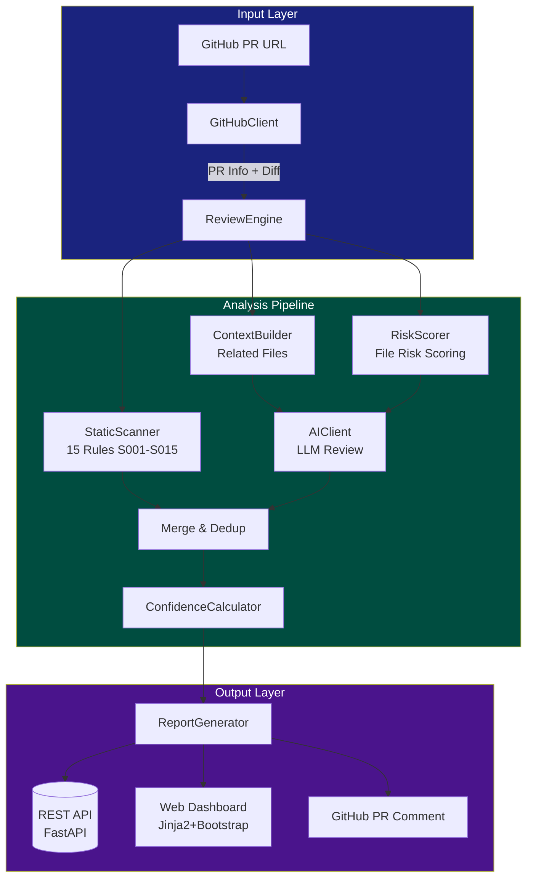

# AI Code Review

AI-powered GitHub Pull Request code review assistant. Automatically analyzes PR diffs, identifies risks, and generates structured review reports.

## V1.1 Features

- **GitHub PR Integration** — Parse PR URLs, fetch diffs, file contents, and post comments
- **Patch-Only Static Scanning** — Rules only scan added/modified lines, avoiding false positives on unchanged code (S001-S015)
- **File Risk Scoring** — Score files by path, change size, and keywords to prioritize AI analysis depth (`deep`/`normal`/`skip`)
- **Multi-Stage AI Review** — PR summary → file-level analysis → cross-file consistency check
- **Rule + AI Hybrid** — Deterministic rules + semantic AI with confidence-based merging
- **Confidence Filtering** — `>= 0.80` GitHub-ready, `0.60-0.79` report only, `< 0.60` hidden
- **Signature Dedup** — Merge findings by file + type + line bucket + title similarity
- **GitHub Comment** — Optional auto-posting of high-confidence findings to PR conversation
- **Web Dashboard** — Three-panel report view with severity/confidence filters and feedback buttons

## Architecture

The system follows a multi-stage pipeline architecture that transforms a GitHub PR into a structured review report:



### Review Pipeline Stages

| Stage | Step | Description |
|-------|------|-------------|
| 1 | FETCHING_PR | Parse PR URL, fetch metadata + diff via GitHub API |
| 2 | BUILDING_CONTEXT | Identify related files, build multi-layer context |
| 3 | STATIC_SCAN | Run 15 deterministic rules on patch added lines |
| 4 | AI_PR_SUMMARY | LLM generates PR-level summary |
| 5 | AI_FILE_REVIEW | Per-file deep/normal analysis by risk score |
| 6 | AI_CROSS_FILE | Cross-file consistency check (≥2 files) |
| 7 | MERGING_RESULTS | Signature dedup + confidence scoring + threshold filter |

## Testing

```
tests/
├── test_diff_utils.py          # Parse patch edge cases (5 tests)
├── test_static_scanner.py      # S005/S014/S011/S010, safe patterns (8 tests)
├── test_risk_scorer.py         # Scoring by path/keywords/size (6 tests)
├── test_confidence_calculator.py # Thresholds, agreement, overrides (7 tests)
└── test_github_client.py       # URL parsing (3 tests)
```

Run tests:
```bash
python -m pytest tests/ -v
```

## CI/CD

[](https://github.com/HuLi-12/ai-pre-review/actions/workflows/ci.yml)

On push/PR to `master`: Python 3.10, install deps, run 28 tests, verify import integrity.

## Quick Start

```bash
# 1. Configure environment
cp .env.example .env
# Edit .env: set GITHUB_TOKEN, AI_API_KEY

# 2. Install dependencies
pip install -r requirements.txt

# 3. Start server
python main.py

# 4. Open browser
# http://localhost:8000
```

## Demo Scenarios

Run the demo verification script to test core components:

```bash
python test_demo.py
```

### PR 1: Low Risk (Documentation)
- **Input**: README.md changes only
- **Expected**: LOW risk, no findings, merge suggested

### PR 2: Medium Risk (Business Logic)
- **Input**: Service method changes without test updates
- **Expected**: MEDIUM risk, S015 test gap flagged

### PR 3: High Risk (Security Issues)
- **Input**: Hardcoded passwords, unsafe SQL, loop DB calls, missing auth
- **Expected**: HIGH risk, S005/S014 visible (conf=0.85), print/TODO filtered

## Project Structure

```
main.py                          # FastAPI server + page routes
config.py                        # Settings (GitHub/AI/DB)
app/
  github_client.py               # GitHub API: PR info, diff, comments
  static_scanner.py              # 15 static rules, patch-only scanning
  diff_utils.py                  # Unified diff parser
  risk_scorer.py                 # File risk scoring engine
  ai_client.py                   # LLM client with structured prompts
  confidence_calculator.py       # Confidence scoring with rule overrides
  context_builder.py             # Multi-layer code context assembly
  review_engine.py               # 7-stage review orchestration
  report_generator.py            # Report + GitHub comment formatting
  models.py / schemas.py         # DB models + API schemas
  routers/                       # REST API endpoints
templates/                       # Jinja2 web UI
```

## API

| Method | Path | Description |
|--------|------|-------------|
| POST | `/api/tasks` | Create PR review task |
| GET | `/api/tasks/{id}` | Get task status |
| GET | `/api/tasks/{id}/report` | Get review report |
| POST | `/api/findings/{id}/feedback` | Submit feedback |
| GET | `/api/tasks/{id}/files` | List changed files |

## Tech Stack

Python + FastAPI + SQLAlchemy + SQLite + Jinja2 + Bootstrap 5
